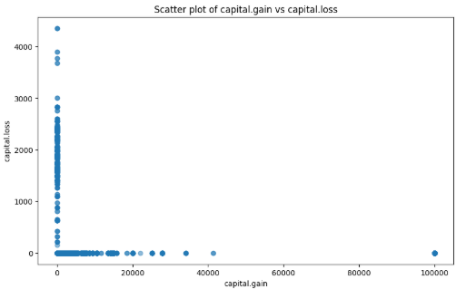
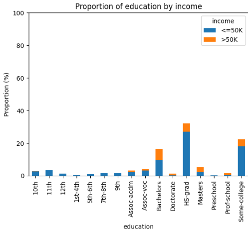
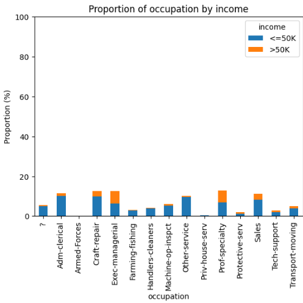

# responsibleAI-proyecto01

## Integrantes

- Brian Carrillo
- Carlos López
- Josué Morales
- Arturo Argueta
- Diego Alonzo

## EDA

### Valores faltantes

No hay valores faltantes aunque si hay varias columnas cualitativas que poseen datos desconocidos que son marcados como '?'.

### Descripción preliminar

Hay 6 variables cuantitativas y 9 cualitativas.
El perfil más común a nivel cualitativo sería aquel con las siguientes características: Trabajando en una institución privada, graduado de secundaria, casado, profesor, hombre, blanco, estadounidense y ingreso menor a 50k. Asimismo, la edad media es de 37 años, nivel de educación medio es 10, con una ganancia media anual de 0, pérdida media anual de 0 y trabajando 40 horas semanales (8 horas diarias).
Esto permite observar que el perfil común no estaría ganando y estaría muy lejos de ganar arriba de 50k anuales.

### Sesgos

#### Clase trabajadora

Se observa un sesgo al haber una diferencia abismal entre las personas que trabajan en privado que en los demás tipos de empleo como puede ser que estén trabajando por su propia cuenta, trabajando para el gobierno, etcétera.

#### Educación

Igualmente se observa aquí cierto sesgo en esta característica ya que existe una clara tendencia a solo observar personas con un nivel de educación de entre secundaria y universidad. Por lo que no se están tomando tan en cuenta otro tipo de personas con un menor nivel de educación.

### Raza

Claramente aquí hay un sesgo de razas ya que más del 85% de la población de los datos son blancos por lo que el modelo pudiera estar sujeto a un sesgo en el cuál solo se analicen personas blancas correctamente, o que las personas de toda aquella raza que no sea blanca para este estudio haya tenido un ingreso mayor o menor a 50k lo que haría este modelo inservible para todos aquellos que no caigan en esta categoría.

### País

Dado que existe muy pocos registros para poder evaluar personas de otros países que no sean estadounidenses, se recomienda descartar a todos aquellos que no pertenezcan a dicha nacionalidad ya que sino quedaría un modelo muy desbalanceado.

### Edad

Se observa cierto sesgo a ciertas edades alrededor de los 20 a 50 años, esto tiene sentido ya que es el rango de edad _útil_ de trabajo normalmente. Por lo que valdría la pena recortar el modelo para que se enfoque en dichas edades de forma que sea más certero al concentrarse en una población representativa en específico.

### Variables representativas

Se proponen las siguientes variables para el modelo:

Se observa que no existen variables cuantitativas correlacionadas por lo que se supone independencia entre las mismas.

Dado que se observa que no existe una tendencia entre estas dos variables de ingreso o pérdida, realmente al estar directamente relacionadas con ganancia o pérdida se supondría que dichas variables podrían contribuír al modelo para detectar correctamente si es o no un ingreso mayor a 50k.

Se observa que existe una mayor tendencia a que el hombre gane más, al menos proporcionalmente, por lo que esto podría suponer otro factor que contribuya al modelo.

La educación, en ciertos niveles si puede suponer una mayor probabilidad de ganar 50k por lo que se propone como una de las variables para el modelo.

Definitivamente ser o no casado dentro de este dataset puede significar una mayor probabilidad de que tenga un ingreso mayor o no a 50k.

Dependiendo de la ocupación que se disponga, igulamente existe una mayor probabilidad de que se gane más dinero.
