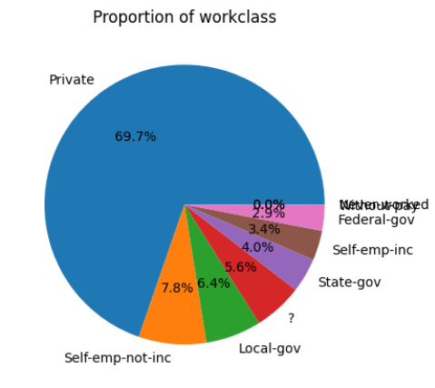
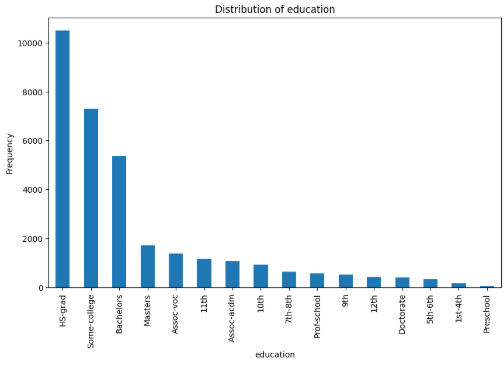
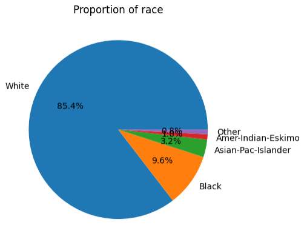

# IA Responsable — Proyecto 01

Este sitio resume el proyecto de **IA Responsable** aplicando los principios **FATE** (Fairness, Accountability, Transparency, Ethics) sobre el dataset **Adult Census Income (UCI)**. Se entrena un **modelo base** y una **versión mitigada** usando `class_weight="balanced"`, y se evalúa el desempeño **segmentado por grupos sensibles** (sexo, edad y raza).

- **Repositorio**: [https://github.com/carrillo21108/responsibleAI-proyecto01](Enlace)
- **Código completo**: [project-eda.ipynb](project-eda.ipynb) · [baseModel.ipynb](baseModel.ipynb)  
- **Instrucciones de reproducción**: ver [README.md](README.md)

---

## TL;DR — Resultados clave

- **Dataset**: 32,561 filas · 15 columnas · atributos sensibles usados para segmentar: `sex`, `race`, `age`.  
- **Mejor baseline (sin balanceo)** — *Logistic Regression*: **Accuracy 0.8096**, **F1 0.5110**, **ROC AUC 0.8221**.  
- **Mitigación (`class_weight="balanced"`)** — *Logistic Regression*: **Accuracy 0.7375**, **F1 0.5797**, **ROC AUC 0.8231**.  
- **Efecto**: la mitigación **aumenta el recall/TPR** de la clase positiva (FN ↓, TP ↑), mejora **F1** y reduce algunas brechas de **Equal Opportunity** (TPR por grupo), a costa de **mayor FPR** y **Positive Rate** en varios subgrupos.

---

## 1) Contexto y objetivo

Los modelos de ML pueden **heredar o amplificar sesgos** presentes en los datos o en el diseño/uso del sistema.  
**Objetivo del proyecto**:
1) Identificar posibles sesgos en **datos** y **modelo**,  
2) **Evaluar** el impacto por subgrupos sensibles,  
3) **Aplicar** una mitigación y **comparar** antes vs. después,  
4) **Reflexionar** sobre riesgos, transparencia y responsabilidad.

---

## 2) Datos (Adult Census Income — UCI)

- **Tamaño**: 32,561 registros, 15 columnas (6 numéricas, 9 categóricas).  
- **Valores “?”**: `workclass` (1,836), `occupation` (1,843), `native.country` (583).  
- **Atributos sensibles**: `sex`, `race` y `age` (agrupada en bins).  
El EDA (ver notebook) reporta distribuciones por categoría, estadísticas numéricas y manejo de “?” como `NaN` y posterior imputación/One-Hot.

**Hallazgos clave del EDA**
- **Distribución del target**: ~24% de la clase positiva (>50K) y ~76% de la negativa (<=50K) → desbalance moderado.
- **Workclass**: predominio del sector privado (Private) frente a gobierno/cuenta propia → posible sesgo por sobrerrepresentación.
- **Educación**: concentración entre secundaria–universidad; menor presencia en niveles extremos.
- **Raza**: ~85% White; otras razas con bajo soporte → riesgo de alta varianza e inequidad si no se controla.
- **País** (`native_country`): mayoría Estados Unidos; múltiples categorías raras con muy pocos registros.
- **Edad**: mayor densidad entre 20–50 años (población laboral activa); útil estratificar en bins para análisis.

**Tratamiento de datos (según EDA/Pipeline)**
- Reemplazo de `"?"` por `NaN` en categóricas antes de estadísticas/plots.
- Imputación: **mediana** (numéricas) y **moda** (categóricas).
- Codificación: **OneHotEncoder(handle_unknown="ignore")** para robustez ante categorías no vistas.

**Variables candidatas usadas**
- Numéricas: `age`, `education_num`, `hours_per_week`, `capital_gain`, `capital_loss`.
- Categóricas: `workclass`, `education`, `marital_status`, `occupation`, `sex`, `race`, `native_country`.

**Gráficas (EDA)**

<div style="display:flex; flex-wrap:wrap; gap:16px; justify-content:flex-start;">
	<figure style="margin:0; width:calc(33.333% - 16px); min-width:220px;">
		
		<figcaption style="text-align:center; font-size:0.9em; margin-top:4px;">Trabajo (workclass)</figcaption>
	</figure>
	<figure style="margin:0; width:calc(33.333% - 16px); min-width:220px;">
		
		<figcaption style="text-align:center; font-size:0.9em; margin-top:4px;">Educación</figcaption>
	</figure>
	<figure style="margin:0; width:calc(33.333% - 16px); min-width:220px;">
		
		<figcaption style="text-align:center; font-size:0.9em; margin-top:4px;">Raza</figcaption>
	</figure>
	<figure style="margin:0; width:calc(33.333% - 16px); min-width:220px;">
		
		<figcaption style="text-align:center; font-size:0.9em; margin-top:4px;">País (native_country)</figcaption>
	</figure>
	<figure style="margin:0; width:calc(33.333% - 16px); min-width:220px;">
		
		<figcaption style="text-align:center; font-size:0.9em; margin-top:4px;">Edad</figcaption>
	</figure>
	<figure style="margin:0; width:calc(33.333% - 16px); min-width:220px;">
		
		<figcaption style="text-align:center; font-size:0.9em; margin-top:4px;">Correlaciones numéricas</figcaption>
	</figure>
	<figure style="margin:0; width:calc(33.333% - 16px); min-width:220px;">
		
		<figcaption style="text-align:center; font-size:0.9em; margin-top:4px;">Capital gain vs capital loss</figcaption>
	</figure>
	<figure style="margin:0; width:calc(33.333% - 16px); min-width:220px;">
		50K" style="width:100%; height:auto; display:block; border:1px solid #eee; border-radius:4px;" />
		<figcaption style="text-align:center; font-size:0.9em; margin-top:4px;">Sexo vs objetivo (>50K)</figcaption>
	</figure>
	<figure style="margin:0; width:calc(33.333% - 16px); min-width:220px;">
		50K" style="width:100%; height:auto; display:block; border:1px solid #eee; border-radius:4px;" />
		<figcaption style="text-align:center; font-size:0.9em; margin-top:4px;">Educación vs objetivo (>50K)</figcaption>
	</figure>
	<figure style="margin:0; width:calc(33.333% - 16px); min-width:220px;">
		50K" style="width:100%; height:auto; display:block; border:1px solid #eee; border-radius:4px;" />
		<figcaption style="text-align:center; font-size:0.9em; margin-top:4px;">Estado civil vs objetivo (>50K)</figcaption>
	</figure>
	<figure style="margin:0; width:calc(33.333% - 16px); min-width:220px;">
		50K" style="width:100%; height:auto; display:block; border:1px solid #eee; border-radius:4px;" />
		<figcaption style="text-align:center; font-size:0.9em; margin-top:4px;">Ocupación vs objetivo (>50K)</figcaption>
	</figure>
</div>


## 3) Pipeline y modelos

**Preprocesamiento**
- Numéricas → imputación **mediana**.  
- Categóricas → imputación **más frecuente** + **OneHotEncoder**.

**Modelos evaluados**
- Baseline: **Logistic Regression**, **Decision Tree**.  
- Mitigación: mismas arquitecturas con `class_weight="balanced"`.

**Partición**
- Train 75% / Test 25%, `stratify=y`, `random_state=42`.

---

## 4) Métricas globales (Test)

| Modelo                  | Accuracy |   F1   | ROC AUC |
|-------------------------|:-------:|:-----:|:-------:|
| Logistic (baseline)     | 0.8096  | 0.5110| 0.8221  |
| Tree (baseline)         | 0.7978  | 0.4607| 0.8029  |
| **Logistic (balanced)** | **0.7375** | **0.5797** | **0.8231** |
| Tree (balanced)         | 0.6593  | 0.5473| 0.8061  |

**Matrices de confusión (test)**  
- *Logistic — baseline*: **TN=5781**, **FP=400**, **FN=1150**, **TP=810**  
- *Logistic — balanced*: **TN=4530**, **FP=1651**, **FN=486**, **TP=1474**

**Lectura**  
La versión **balanced** sacrifica *accuracy* (más FP) para **recuperar muchos positivos** (menos FN) → **sube F1**. El **AUC** (ranking) se mantiene ≈ igual, consistente con cambiar la penalización/umbral más que la capacidad discriminativa.

---

## 5) Equidad: evaluación segmentada por subgrupos

Se reportan métricas por grupo: **accuracy, F1, TPR (recall), FPR, Positive Rate**.  
También se muestran **“brechas”** (max–min entre grupos) para cada métrica: menor es mejor.

### 5.1. Sexo (`sex`) — *antes vs. después*

**Antes (Logistic — baseline)**

| sex    |   n  | accuracy |   F1   |   TPR  |   FPR  | Positive Rate |
|--------|-----:|:--------:|:------:|:------:|:------:|:-------------:|
| Male   | 5458 | 0.7684   | 0.5549 | 0.4730 | 0.1018 | 0.2151        |
| Female | 2683 | 0.8934   | 0.1333 | 0.0748 | 0.0059 | 0.0134        |

**Después (Logistic — balanced)**

| sex    |   n  | accuracy |   F1   |   TPR  |   FPR  | Positive Rate |
|--------|-----:|:--------:|:------:|:------:|:------:|:-------------:|
| Male   | 5458 | 0.6849   | 0.6130 | 0.8175 | 0.3734 | 0.5090        |
| Female | 2683 | 0.8446   | 0.3495 | 0.3810 | 0.0984 | 0.1293        |

**Brechas (max–min)**

| Modelo              | gap_accuracy | gap_f1 | gap_tpr | gap_fpr | gap_positive_rate |
|---------------------|:------------:|:------:|:-------:|:------:|:-----------------:|
| Baseline            |   0.1250     | 0.4216 | 0.3982  | 0.0959 |      0.2017       |
| **Balanced**        | **0.1597**   | 0.2635 | 0.4366  | 0.2751 |    **0.3796**     |

**Resumen**: la mitigación **eleva TPR** y **mejora F1** en ambos sexos (mejor *Equal Opportunity*), pero **aumenta FPR y Positive Rate**, ampliando brechas en *Demographic Parity*.

---

### 5.2. Edad (`age`, bins) — *antes vs. después*

**Antes (Logistic — baseline)**

| age_bin |   n  | accuracy |   F1   |   TPR  |   FPR  | Positive Rate |
|---------|-----:|:--------:|:------:|:------:|:------:|:-------------:|
| 30–49   | 3927 | 0.7601   | 0.4875 | 0.3727 | 0.0690 | 0.1620        |
| <30     | 2407 | 0.9393   | 0.1412 | 0.0902 | 0.0110 | 0.0154        |
| 50–69   | 1647 | 0.7511   | 0.6103 | 0.5459 | 0.1350 | 0.2817        |
| 70+     |  160 | 0.6750   | 0.5273 | 0.7838 | 0.3577 | 0.4562        |

**Después (Logistic — balanced)**

| age_bin |   n  | accuracy |   F1   |   TPR  |   FPR  | Positive Rate |
|---------|-----:|:--------:|:------:|:------:|:------:|:-------------:|
| 30–49   | 3927 | 0.7041   | 0.5979 | 0.7188 | 0.3024 | 0.4298        |
| <30     | 2407 | 0.8816   | 0.2674 | 0.3910 | 0.0897 | 0.1064        |
| 50–69   | 1647 | 0.6387   | 0.6387 | 0.8946 | 0.5033 | 0.6430        |
| 70+     |  160 | 0.4062   | 0.4025 | 0.8649 | 0.7317 | 0.7625        |

**Brechas (max–min)**

| Modelo       | gap_accuracy | gap_f1 | gap_tpr | gap_fpr | gap_positive_rate |
|--------------|:------------:|:------:|:-------:|:------:|:-----------------:|
| Baseline     |   0.2643     | 0.4691 | 0.6936  | 0.3467 |      0.4409       |
| **Balanced** | **0.4753**   | 0.3714 | 0.5036  | 0.6420 |    **0.6561**     |

**Resumen**: la mitigación **sube TPR** en todos los bins (recupera positivos), pero **aumenta FPR** —más en personas mayores— y la tasa de positivos predicha.

---

### 5.3. Raza (`race`) — *antes vs. después*

**Antes (Logistic — baseline)**

| race               |  n  | accuracy |   F1   |   TPR  |   FPR  | Positive Rate |
|--------------------|----:|:--------:|:------:|:------:|:------:|:-------------:|
| White              |7017 | 0.8002   | 0.5212 | 0.4253 | 0.0710 | 0.1616        |
| Black              | 725 | 0.8855   | 0.2783 | 0.1818 | 0.0173 | 0.0372        |
| Asian-Pac-Islander | 257 | 0.8093   | 0.5586 | 0.4697 | 0.0733 | 0.1751        |
| Amer-Indian-Eskimo |  79 | 0.8608   | 0.0000 | 0.0000 | 0.0286 | 0.0253        |
| Other              |  63 | 0.9206   | 0.0000 | 0.0000 | 0.0333 | 0.0317        |

**Después (Logistic — balanced)**

| race               |  n  | accuracy |   F1   |   TPR  |   FPR  | Positive Rate |
|--------------------|----:|:--------:|:------:|:------:|:------:|:-------------:|
| White              |7017 | 0.7241   | 0.5872 | 0.7676 | 0.2908 | 0.4127        |
| Black              | 725 | 0.8566   | 0.4694 | 0.5227 | 0.0973 | 0.1490        |
| Asian-Pac-Islander | 257 | 0.7043   | 0.5422 | 0.6818 | 0.2880 | 0.3891        |
| Amer-Indian-Eskimo |  79 | 0.8354   | 0.4348 | 0.5556 | 0.1286 | 0.1772        |
| Other              |  63 | 0.8730   | 0.2000 | 0.3333 | 0.1000 | 0.1111        |

**Brechas (max–min)**

| Modelo       | gap_accuracy | gap_f1 | gap_tpr | gap_fpr | gap_positive_rate |
|--------------|:------------:|:------:|:-------:|:------:|:-----------------:|
| Baseline     |   0.1204     | 0.5586 | 0.4697  | 0.0560 |      0.1498       |
| **Balanced** | **0.1687**   | 0.3872 | 0.4342  | 0.1935 |    **0.3016**     |

**Resumen**: mejora el **TPR** (oportunidad) para varios grupos, pero incrementan **FPR** y **Positive Rate**; en grupos con **muy bajo soporte** (por ejemplo, `Other` y `Amer-Indian-Eskimo`) persisten inestabilidades.

---

## 6) Mitigación aplicada y alternativas

**Aplicada**: `class_weight="balanced"` en Logistic y Tree.  
- Ventajas: **↑ TPR/recall** de la clase positiva, **↑ F1**, **↓ brechas EO** en varios casos.  
- Costos: **↑ FPR** y **↑ Positive Rate** → posibles efectos en *Demographic Parity*.

**Alternativas recomendadas**
- **Ajuste de umbral por grupo** (optimización *precision–recall* con restricciones de EO/EqOdds).  
- **Rebalanceo de datos** (over/under-sampling) o **reweighing** previo.  
- **Post-procesamiento** (p. ej., *Equalized Odds*).  
- **Agrupar/reescalar** categorías con **n** muy bajo para reducir varianza.

---

## 7) Reproducibilidad

**Requisitos**
```bash
python -m pip install -r requirements.txt
```

## 8) Responsabilidad, transparencia, ética y limitaciones

**Responsabilidad (Accountability)**
- Versionado y trazabilidad: commits atómicos con mensajes claros; notebooks con `random_state` fijado.
- Registro de experimentos: anotar fecha, datos, hiperparámetros, métricas y figuras exportadas.
- Revisión por pares: documentar decisiones (por qué este umbral/mitigación) y sus efectos.

**Transparencia (Transparency)**
- Pipeline documentado: imputación, codificación, modelo, umbral de decisión y atributos sensibles.
- Métricas de equidad: definir *qué* se reporta (TPR/EO, FPR, Positive Rate/DP) y *por qué*.
- Publicación: notebooks y scripts reproducibles; `requirements.txt` y pasos en README.

**Ética (Ethics)**
- Riesgos y uso responsable: evitar despliegues sin monitoreo; impacto en grupos vulnerables.
- Selección de criterios de equidad: justificar EO/DP según el caso de uso.
- Gobernanza de datos: respetar licencias y privacidad; no introducir atributos sensibles en producción sin justificación.

**Limitaciones**
- Dataset: desbalance de clases; subgrupos con **n** muy bajo → alta varianza (inestabilidades en F1/TPR).
- *Label/selection bias*: etiquetas históricas pueden arrastrar sesgos sistémicos.
- *Distribution shift*: el rendimiento y la equidad pueden cambiar si cambia la población.
- Umbral: pequeñas variaciones alteran TPR/FPR; conviene análisis de sensibilidad.

---

## 9) Conclusiones y recomendaciones

**Qué mejoró (equidad y desempeño)**
- **↑ TPR (Equal Opportunity)** en la mayoría de subgrupos con `class_weight="balanced"` → se reducen falsos negativos y aumenta la probabilidad de acierto para la clase positiva en grupos históricamente subrepresentados.
- **↑ F1** de la clase positiva gracias al aumento del recall, manteniendo **ROC AUC** similar (la capacidad de ranking no se deteriora).
- En varias segmentaciones (sexo/raza), la **brecha de TPR** (gap EO) se **estrecha** respecto al baseline.

**Qué no mejoró / trade-offs observados**
- **↑ FPR** y **↑ Positive Rate** en varios subgrupos → puede **ampliar brechas de Demographic Parity** (más positivos predichos en ciertos grupos).
- **↓ Accuracy** global por el aumento de falsos positivos (costo esperado al priorizar recall/equidad).
- Persisten inestabilidades en grupos con **muy bajo soporte** (n pequeño), donde F1/TPR pueden fluctuar.

**Riesgos al desplegar en entornos reales**
- **Impacto desigual**: mayores FPR en ciertos grupos pueden traducirse en costos o fricciones desproporcionadas.
- **Feedback loops**: decisiones del modelo pueden reforzar sesgos (p. ej., si influyen futuras etiquetas/datos).
- **Shift de distribución**: cambios en la población degradan desempeño y equidad si no hay monitoreo.
- **Gobernanza y cumplimiento**: se requiere trazabilidad, explicaciones y mecanismos de apelación para usuarios afectados.

**Recomendaciones prácticas**
- **Ajuste de umbral** (global y/o por grupo) guiado por curvas **PR/ROC**, priorizando objetivos de **EO** o **EqOdds** según el caso de uso.
- **Mitigaciones de datos**: *reweighing*, sobre/sub-muestreo estratificado y ampliación de datos en subgrupos con **n** bajo.
- **Post-procesamiento de fairness** (p. ej., equalized odds/EO) para controlar TPR/FPR por grupo sin reentrenar todo el pipeline.
- **Calibración por grupo** (reliability curves/Platt/Isotónica) para alinear probabilidades y reducir sesgos de decisión.
- **Monitoreo continuo**: dashboard de métricas **por subgrupo** (TPR/FPR/PositiveRate, gaps), alertas de **drift** y auditorías periódicas.
- **Proceso humano-en-el-bucle**: revisión de casos límite, documentación (*model card*), registro de decisiones y canal de apelación.
